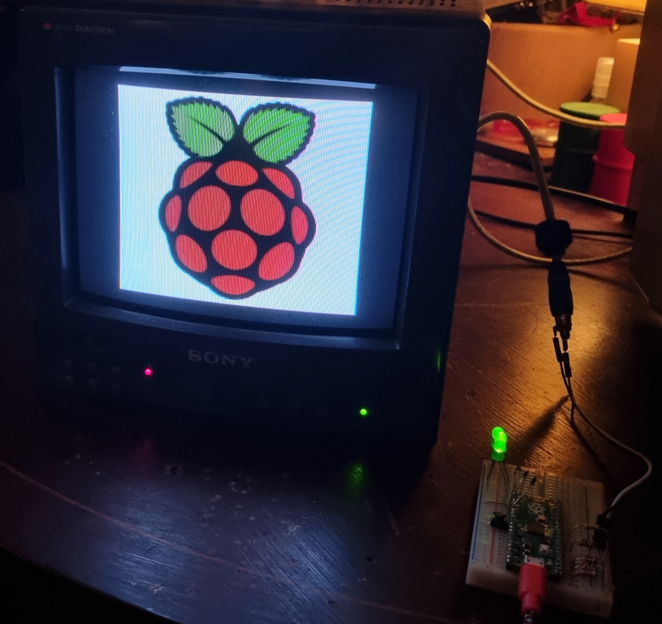
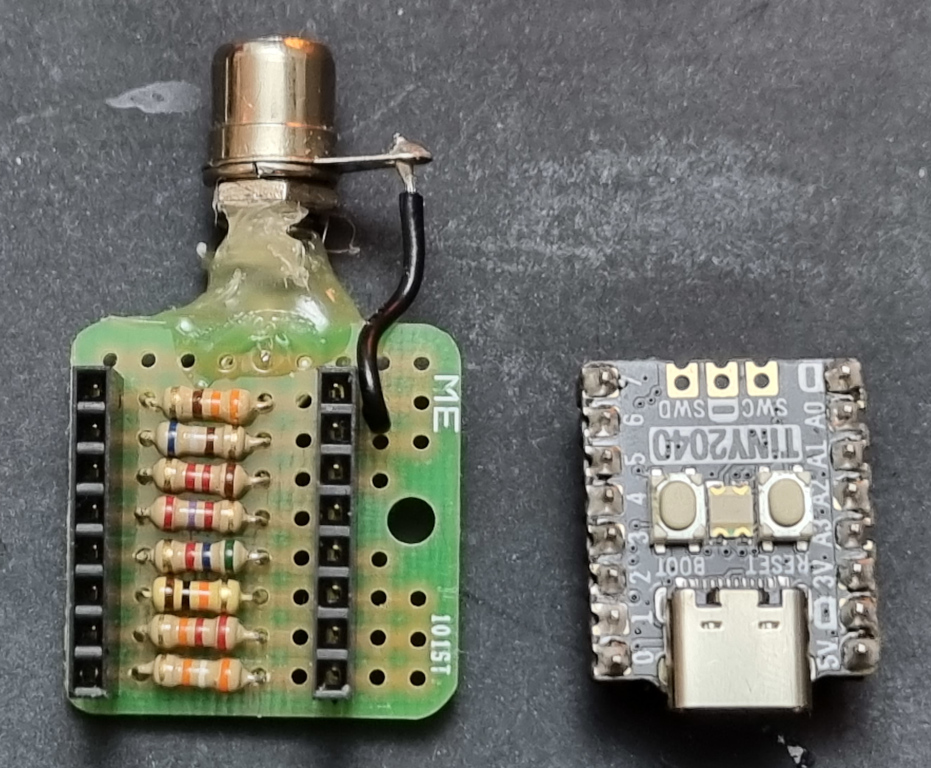

# pico-composite-PAL-colour #

Trying to get the [Raspberry Pi RP2040](https://www.raspberrypi.com/documentation/microcontrollers/rp2040.html) chip's PIO to generate a colour PAL composite video signal, using only a [resistor ladder](https://en.wikipedia.org/wiki/Resistor_ladder) digital-to-analogue converter (DAC).

**WARNING: THERE IS A CHANCE THIS SOFTWARE MAY DAMAGE YOUR PICO. I TAKE NO RESPONSIBILITY.**
I'm running the RP2040 at 312 MHz. This is a 141% overclock (or 241% of stock) with a 1.2 VREG voltage. The clock divider on the PIO is about 9. It is a lot of data to process in not a very long period of time (64 microseconds). I believe I have partially broken at least one RP2040 working on this - it no longer registers when plugged into some computers and the GPIO seems to have 5 V coming out.

As for my specific hardware, I've used both a [Pimoroni Tiny2040](https://shop.pimoroni.com/products/tiny-2040?variant=39560012300371) and a regular PICO. I've built two different simple (read: less precise) resistor DACs. The original consists of one each of a 39k, 22k, 10k, 5.6k, 2.7k, 1.2k, 680, and 330 Ω resistors hooked up to GPIO pins 0 through 7. That DAC, when combined with the 75 Ω termination load of a composite signal should have a 0-1 V range. When making it I did not know colour PAL should have a peak voltage of 1.25 V, leading to my newer DAC with 33k, 18k, 10k, 5.6k, 2.2k, 1k, 560 and 270  Ω resistors. To calculate, you can use 1.25 V = 3.3 V * 75 Ω / (75 Ω + sum of 8 resistor values each roughly doubling). You will ideally want 1 V to be produced when a value of 128 is written to the DAC. The above photo shows my newer DAC, and the below photo the older DAC.

I have a suspicion that when overclocked not all RP2040 chips end up at exactly the same frequencies, and not all TVs lock on to the PAL colour carrier as easily, so if you are unable to see a colour image you may need to play with the `CLOCK_SPEED` and `CLOCK_DIV` settings. In a perfect world it should have worked for me with a 319.2 MHz clock and 8.9994 divider, but in practice my PVM locks on with a 321 MHz and 9.004 divider. It was down to trial and error, multiplying the divider by 0.99, 0.98, 0.97, etc., until my PVM tried to lock onto the signal as if it was SECAM (which lives at 4.40 and 4.25 MHz), at which point I moved at smaller increments until it worked (0.9911, 0.9912 0.9913, etc.).

Due to the technical limitations of RAM and DAC timings, it's been an ongoing effort to work out video resolutions. The best I've been able to get so far is a "super high" resolution of 220x110 at roughly a 7 bit colour depth. On screen the image displays as 220x220 a stretched out to a roughly 1.5:1 aspect ratio. I have a lot more appreciation for the engineers of the 80s that did better than this with a chip running 1/200th the speed! The major challenge for higher resolutions at this point is RAM, and I think a more standard 320x200 resolution is otherwise possible.

## Resources ##

A bit of research was needed to understand how composite video and colour composite video work, and how I could make it work on the Pico. I found these resources quite helpful.

### Composite Video ###

Details on composite video specifications...

* http://martin.hinner.info/vga/pal.html
* http://www.batsocks.co.uk/readme/video_timing.htm
* https://www.broadcaststore.com/pdf/model/793698/TT148%20-%204053.pdf
* https://elinux.org/images/e/eb/Howtocolor.pdf
* https://web.archive.org/web/20150306030906/http://www.pembers.freeserve.co.uk/World-TV-Standards/Colour-Standards.html
* https://web.archive.org/web/20150305012205/http://www.pembers.freeserve.co.uk/World-TV-Standards/Line-Standards.html
* https://web.archive.org/web/20080201032125/http://www.rickard.gunee.com/projects/video/sx/howto.php
* https://sagargv.blogspot.com/2014/07/ntsc-demystified-color-demo-with.html
* http://people.ece.cornell.edu/land/courses/ece5760/video/gvworks/GV%27s%20works%20%20NTSC%20demystified%20-%20Color%20Encoding%20-%20Part%202.htm

### PICO/RP2040/Tiny2040 ###

How the Pico and RP2040 work...

* https://datasheets.raspberrypi.com/rp2040/rp2040-datasheet.pdf
* https://datasheets.raspberrypi.com/pico/raspberry-pi-pico-c-sdk.pdf
* https://raspberrypi.github.io/pico-sdk-doxygen/

#### DMA ####

Use of the RP2040's DMAs to quickly move data around was critical. These were helpful for understanding how it can be used.

* https://www.youtube.com/watch?v=OenPIsmKeDI
* https://forums.raspberrypi.com/viewtopic.php?t=330348
* https://forums.raspberrypi.com/viewtopic.php?t=311306
* https://forums.raspberrypi.com/viewtopic.php?t=319709

### Similar projects ###

I'm not the first to make a microcontroller generate composite video, not by a long shot. These other projects showed me what was possible and helped convince me I could do colour composite on the RP2040.

#### PICO/RP2040 ####

* https://areed.me/posts/2021-07-14_implementing_composite_video_output_using_the_pi_picos_pio/
* https://github.com/obstruse/pico-composite8
* http://www.breakintoprogram.co.uk/projects/pico/composite-video-on-the-raspberry-pi-pico
* https://github.com/breakintoprogram/pico-mposite
* https://github.com/guruthree/mac-se-video-converter/blob/main/composite.h

#### Other platforms ####

* https://bitluni.net/esp32-color-pal
* https://github.com/bitluni/DawnOfAV/tree/master/DawnOfAV
* https://github.com/rossumur/esp_8_bit
* http://javiervalcarce.eu/html/arduino-tv-signal-generator-en.html
* https://web.archive.org/web/20080201140901/https://www.rickard.gunee.com/projects/video/sx/gamesys.php
* https://web.archive.org/web/20070707125203/http://www.ondraszek.ds.polsl.gliwice.pl/~looser/avr/index.php
* https://www.electronicsforu.com/electronics-projects/tv-pattern-generator
